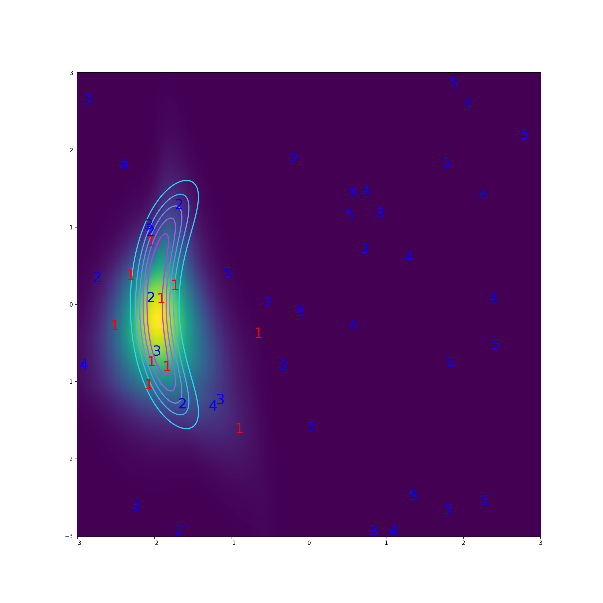

Preferential Normalizing Flows
----------------------------
We show how normalizing flows can be fitted to preferential data representing an oracle's (e.g., expert, human, LLM, etc.) choices between a set of alternatives, as a function-space maximum a posteriori estimate with a novel functional prior. Potential applications:
+ Want to elicit a probability density?
    + Prior elicitation
    + Expert knowledge elicitation
+ Probabilistic reward modelling



Publication
-----------
Please find the arxiv preprint here:
https://arxiv.org/abs/xxxx.xxxxx

Preferential Normalizing Flows is accepted in NeurIPS 2024, citation update is coming up...
```
@article{snf,
  title={Preferential Normalizing Flows},
  author={Petrus Mikkola, Luigi Acerbi, Arto Klami},
  journal = {arxiv:xxxx.xxxxx},
  year = {2024}
}
```


Installation and running the code
------------
**System requirements.**
All experiments were run with Python 3.9.16, PyTorch 2.1.0, and [normflows](https://github.com/VincentStimper/normalizing-flows) 1.7.3 on Linux system, but the same results were also got on MacOS. The code is expected to work on MacOS and Linux systems with these or newer Python and PyTorch versions

**Installation.**
Install dependencies:
```
pip install -r requirements.txt
```

**Want to try or build on top of the code?**
+ Start with ```demo.ipynb```
    + Try different settings, e.g.  ```k``` and ```n``` by modifying the file ```/conf/config.yaml```
    + Try MLE fitting instead of FS-MAP fitting: set ```weightprior: 0.0```

**Want to reproduce the experiments?**
+ Run config files in /conf/experiments/
    + After setting up a virtual machine etc., run somehting like:
    ```
    for experiment_script in "$EXPERIMENT_DIR"/*.sh
    do
        sbatch "$experiment_script"
        sleep 2
    done
    ```